# Advanced-Autoformatter
## Autoformatter
1) На вход подается массив, в котором лежат разделенные парсером строки.
   Основная задача Autoformater разделить массив на строки по всем правилам Си.
   
   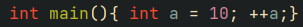
   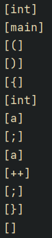
   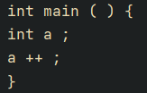
2) Добавляются фигурные скобки для циклов и if, где они не поставлены.
   
   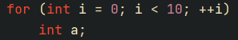
   
   
3) Правильно форматирует комментарии (/* ... */) внутри конструкций и вне.  
   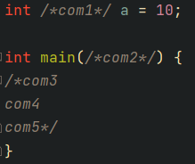

   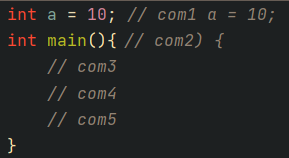
4) После этого готовы трёхмерный массив передается для записи в файл.
В файл записи идет с расставлением табуляций для вложенности и пробелами в нужных местах для читаемости.
   Табы:
   
   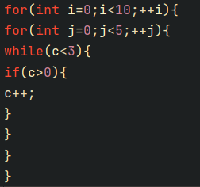

   
   
   Пробелы:
   
   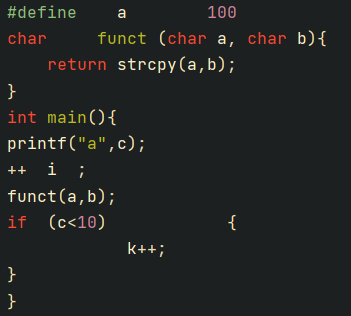

   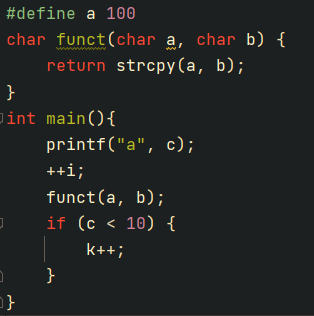

5) Так же в процессе форматировки происходит отслеживание camelCase для переменных и PascalCase для функций и собственных типов.
   
   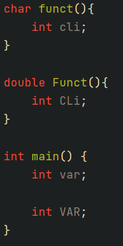 

   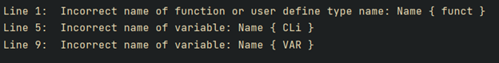
   
   и определение неиспользующихся перменных и функций:
   
   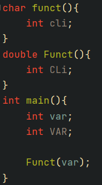

   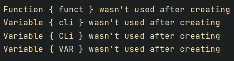
