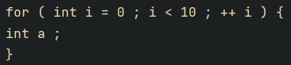
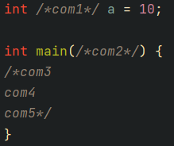
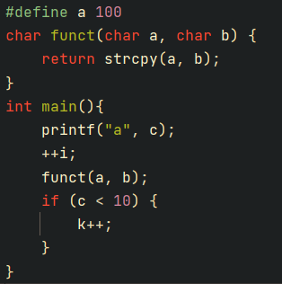
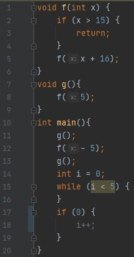
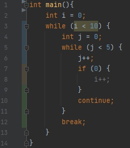

# Advanced-Autoformatter

## Форматирование
1) На вход подается массив, в котором лежат разделенные парсером строки.
   Основная задача Autoformater разделить массив на строки по всем правилам Си.
   
   
   
   
   
   
   
2) Добавляются фигурные скобки для циклов и if, где они не поставлены.
   
   
   
   
   
3) Правильно форматирует комментарии (/* ... */) внутри конструкций и вне.  
   
   

   
   
4) После этого готовы трёхмерный массив передается для записи в файл.
   В файл записи идет с расставлением табуляций для вложенности и пробелами в нужных местах для читаемости.
   Табы:
   
   

   
   
   Пробелы:
   
   

   

5) Так же в процессе форматировки происходит отслеживание camelCase для переменных и PascalCase для функций и собственных типов.
   
    

   
   
   и определение неиспользующихся перменных и функций:
   
   

   

## Анализ функций и циклов

   

   

   

   
   
   

## Анализ интерпретации

1) На вход подается файл, первый парсер создает представление файла в виде массива логических элементов
2) Второй парсер-интерпретатор обрабатывает сложные конструкциии, создавая "листинг" файла:
   for, while, if и do...while представляются в виде логических выражений, создаются метки, которые обрабатываюся далее.
   
3) Для разных меток разработана разная логика, но интерпетация сводится к go to меткам. Полная интерпретация не 
   производится, в большинстве случаев вывод о работе делается либо сразу после интерпретации, либо после обработки нескольких итераций.
   
4) Среди критериев оценки работоспособности конструкций: полнота объявления, наличие итераторов в условии, наличие break/continue

Примеры:
### I.

### II.

### III.

